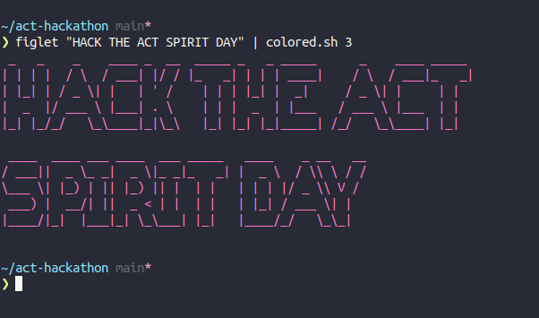

# ACT SPIRIT Hackathon :computer:

Table of contents 
=================
 
* [Mission](#mission)
* [Guidelines](#guidelines) 
* [Ideas](#ideas)
* [Agenda](#agenda)
* [Useful links](#useful-links)
* [FAQ](#faq)

## Mission
### Theme : ACT SPIRIT

We're hosting this hackathon as a way to promote critical thinking, creativity, and problem solving. We strongly encourage you get out of your comfort zone and show the amazing skills we know you possess. 

**Create your team and get ready to HACK The Spirit Day!**

## Guidelines

Start thinking about how you can manifest the ACT Spirit through the utilization of your favorite programming languages/paradigms. 
There will be no specific focus in regards to the tools used during the hackathon, so feel free to work with what you are good at.

Your end result doesn't need to be a full-blown application, it may simply be a blueprint based on the idea you came up with. From that, you can later start working on the technical requirements and make your way to the top. 

#### Ideas 
Below you can find a not-so-detailed list of ideas you can work on during the Hackathon.

 - Data Analysis/ Web Scraping
    - Extract Data regarding ACT/Anatolia College/Liberal Arts Educational Approach from the web and perform data analysis upon them 
 - Tech Community Building
    - e.g. [R Ladies](https://rladies.org/)
    
## Agenda

##### When? 
- From now until 15-10-2020 

|           Time |                           |
| :------------- | :-------------:           |
|          00:00 | Email from the Student Services Office |
|          00:00 | Hackathon Kicks Off       |
|          00:00 | Push your work to GitHub  |
|          00:00 | Post link to the SGA Facebook page |

## Useful Links
- Hackathons https://en.wikipedia.org/wiki/Hackathon
- Web Scraping https://www.webharvy.com/articles/what-is-web-scraping.html

- Learn Git
  - Git by Github, learn via a bot https://lab.github.com/
  - **THE** book https://git-scm.com/book/en/v2
  - Use Git on Windows https://www.computerhope.com/issues/ch001927.htm
  
- Overcome programmer impostor syndrome https://www.codingdojo.com/blog/programmer-imposter-syndrome
  
## FAQ 
TBA

